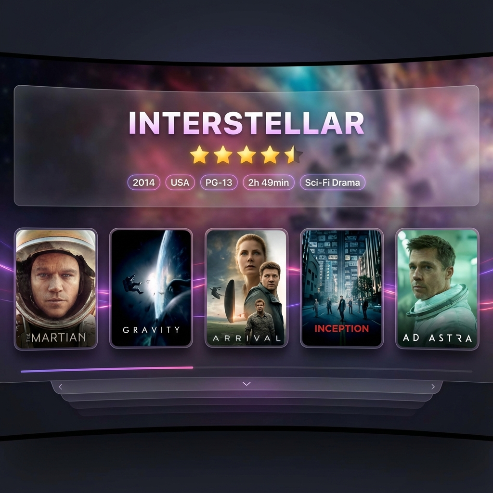

# 🎨 Enhanced Interface Plugin для Lampa

Сучасний, стильний плагін інтерфейсу для [Lampa](https://lampa.mx) з анімаціями, glassmorphism ефектами та кастомізацією тем.



## ✨ Особливості

### 🎭 Візуальні покращення
- **Glassmorphism ефекти** - напівпрозорі панелі з розмиттям фону
- **Плавні анімації** - fade-in, slide-up, scale transitions
- **Динамічний blur фон** - автоматичне розмиття backdrop зображень
- **Анімовані рейтингові зірки** - красива анімація заповнення зірок
- **Gradient текст** - градієнтні заголовки та акценти
- **Glow ефекти** - м'яке світіння навколо елементів

### 🎨 Кольорові теми
Виберіть одну з 5 готових кольорових схем:
- **За замовчуванням** - Фіолетово-рожевий градієнт (#6666ff → #ff66a8)
- **Захід сонця** - Червоно-жовтий (#ff6b6b → #feca57)
- **Океан** - Блакитний (#4facfe → #00f2fe)
- **Ліс** - Зелений (#11998e → #38ef7d)
- **Пурпур** - Темно-фіолетовий (#a044ff → #6a3093)

### 🏷️ Badges та індикатори
- Автоматичний badge "★ Топ" для фільмів з рейтингом 8+
- Badge "Новинка" для свіжих релізів поточного року
- Стильні pills для жанрів, тривалості, рейтингу PG

### 📊 Розширена інформація
- Анімовані зірки рейтингу (1-5 зірок на основі TMDB)
- Додаткова інформація про режисера та студію
- Покращене відображення жанрів
- Трива́лість у зручному форматі (Xч Yхв)

## 📦 Встановлення

### Метод 1: Через URL (рекомендовано)
1. Відкрийте Lampa
2. Перейдіть в **Налаштування** → **Розширення**
3. Натисніть **Додати плагін**
4. Вставте URL до `interface.js`
5. Збережіть та перезавантажте Lampa

### Метод 2: Ручна установка
1. Завантажте файл `interface.js`
2. Додайте його до вашого Lampa через панель плагінів
3. Активуйте плагін у налаштуваннях

## ⚙️ Налаштування

Після встановлення перейдіть в **Налаштування** → **Інтерфейс**:

| Параметр | Опис | За замовчуванням |
|----------|------|------------------|
| **Кольорова тема** | Виберіть кольорову схему | За замовчуванням |
| **Широкі постери** | Формат постерів (16:9 vs 2:3) | Вимкнено |
| **Показувати жанри** | Відображення жанрів у деталях | Увімкнено |
| **Положення стрічки** | Висота інформаційної панелі | Середнє |
| **Анімації** | Плавні переходи та ефекти | Увімкнено |

## 🖼️ Скріншоти

<table>
  <tr>
    <td></td>
    <td></td>
  </tr>
  <tr>
    <td align="center"><b>Тема за замовчуванням</b></td>
    <td align="center"><b>Тема "Захід сонця"</b></td>
  </tr>
</table>

## 🎯 Сумісність

- ✅ Lampa версія 153+
- ✅ Desktop (1280px+)
- ✅ Tablet (768-1280px)
- ⚠️ Mobile - використовується стандартний інтерфейс
- ✅ TMDB джерело
- ✅ CUB джерело
- ✅ Темна тема
- ✅ Світла тема (з адаптацією)

## 🔧 Технічні деталі

### Структура плагіна
```
lampa-interface-plugin/
├── interface.js       # Основний код плагіна
├── manifest.json      # Метадані плагіна
├── README.md          # Документація
├── CHANGELOG.md       # Історія версій
├── assets/            # Ресурси
│   └── icon.svg       # Іконка плагіна
└── screenshots/       # Скріншоти
```

### Основні компоненти

#### ThemeManager
Керує кольоровими темами через CSS змінні:
```javascript
ThemeManager.applyTheme(); // Застосувати поточну тему
```

#### AnimationManager
Контролює анімації елементів:
```javascript
AnimationManager.fadeIn(element, 800);   // Fade in
AnimationManager.slideUp(element, 400);  // Slide up
AnimationManager.scale(element, 600);    // Scale
```

#### EnhancedInfoCreate
Розширена інформаційна панель з:
- Анімованими зірками рейтингу
- Badges для топових фільмів
- Glassmorphism ефектами
- Додатковою інформацією

## 🐛 Відомі обмеження

- Не працює на мобільних пристроях (< 768px) - використовується стандартний інтерфейс
- Анімації можуть гальмувати на слабких пристроях - вимкніть у налаштуваннях
- Деякі теми можуть погано виглядати у світлому режимі

## 📝 Changelog

### Версія 2.0.0 (16.12.2024)
- ✨ Повне переписування плагіна
- 🎨 Додано 5 кольорових тем
- ⭐ Анімовані рейтингові зірки
- 💎 Glassmorphism ефекти
- 🎭 Badges для топових фільмів та новинок
- 🌟 Glow ефекти та плавні анімації
- 📊 Розширена інформаційна панель
- ⚙️ Покращені налаштування

## 🤝 Внесок

Ідеї, багрепорти та pull request'и вітаються!

## 📄 Ліцензія

MIT License - використовуйте вільно!

## 👨‍💻 Автор

Створено з ❤️ для спільноти Lampa

---

**Насолоджуйтесь красивим інтерфейсом! 🎬✨**
